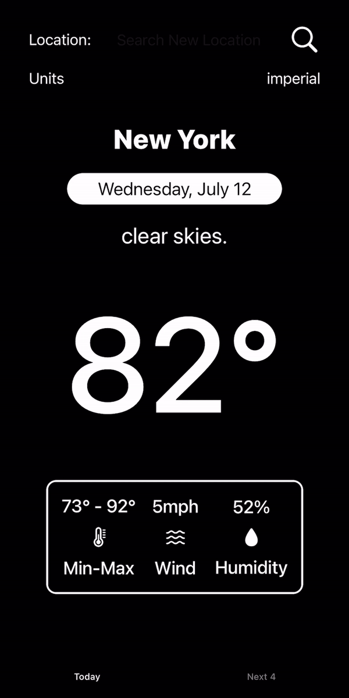

# The Weather App

##  Description
The Weather App is a reliable and user-friendly weather application built using Swift and Tomorrow.io Api. It provides users with seamless access to global weather conditions and accurate four-day forecasts. 

## Key Features 
- Allows users to personalize unit preferences, accommodating both metric and imperial measurement systems.
- Transforms weather forecast into a visually engaging experience with dynamically adjusting images which reflect upcoming weather conditions.
- Automatically loads with a default location, while still giving users the ability to explore any location worldwide. 
- Offers a comprehensive summary of the most relevant conditions for both current and upcoming forecasts.

## Demo

## Technologies 
- SwiftUI
- MVVM

## Requirements 
- IOS 16 +

## Acknowledgements 
- Tomorrow.io Weather Forecast Api
